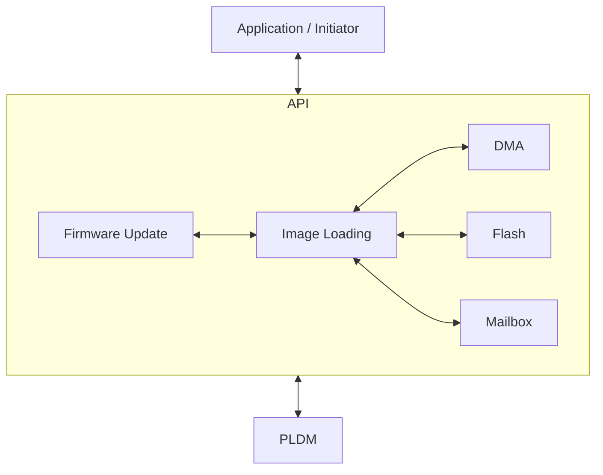
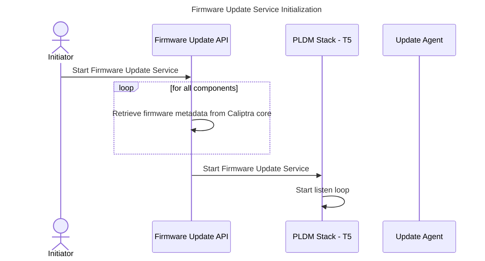
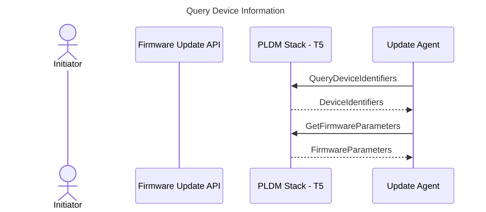
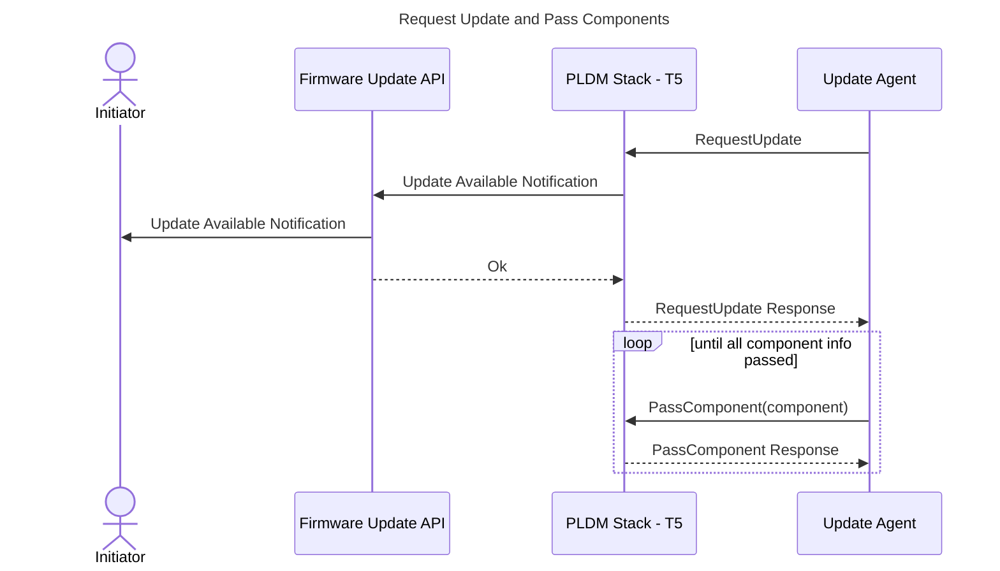
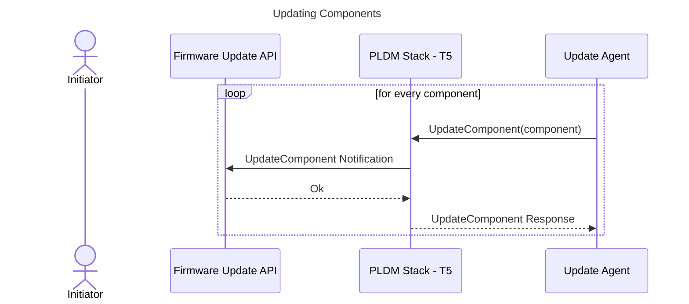
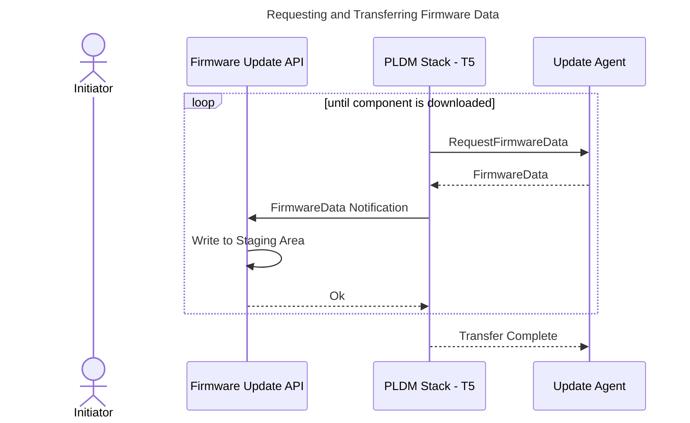
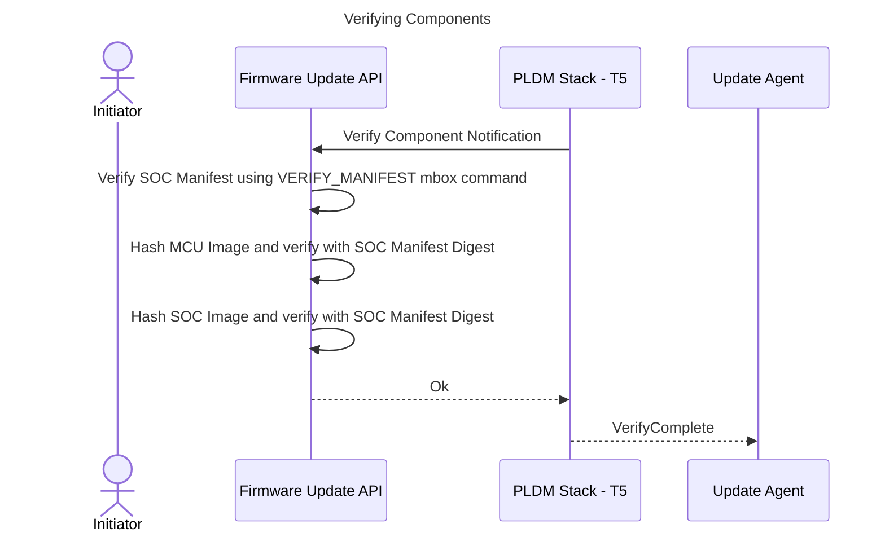
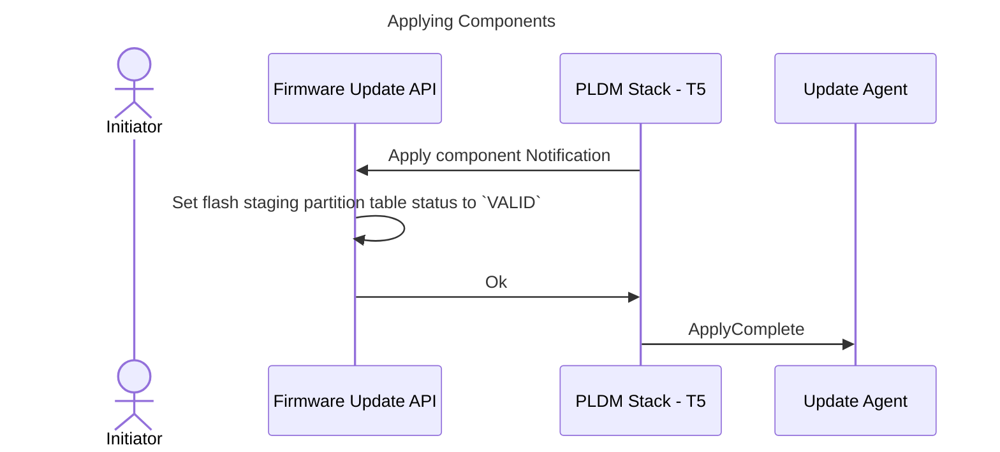
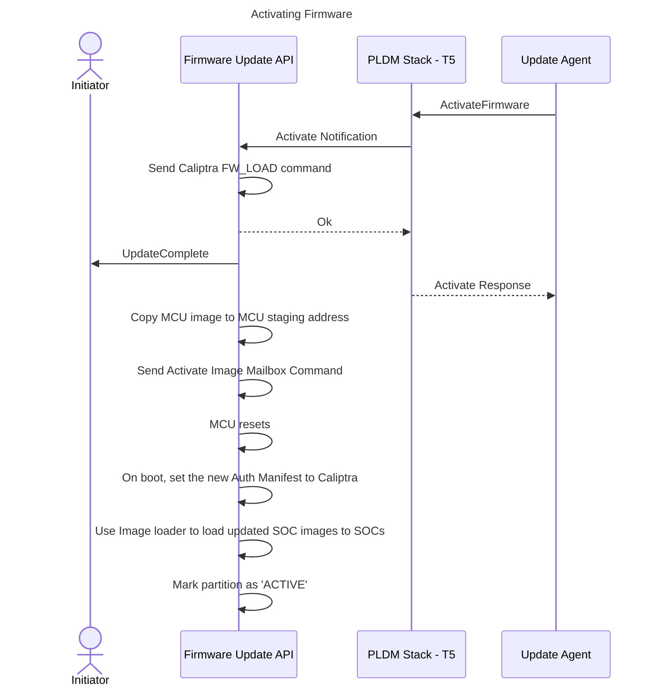

# Firmware Update

## Overview

The MCU SDK offers a comprehensive API designed to facilitate firmware updates for Caliptra FMC & RT, MCU RT, and other SoC images. These updates are performed using the PLDM - T5 protocol and are supported for both streaming boot systems and flash boot systems.

## Architecture

The MCU PLDM stack handles PLDM firmware messages from an external Firmware Update Agent. The stack generates upstream notifications to the Firmware Update API to handle application-specific actions such as writing firmware chunks to a staging or SPI Flash storage location, verifying components, etc through the Image Loading API. The API notifies the application of the start and completion of the firmware update process.



## PLDM Firmware Download Sequence

The diagram below shows the steps and interactions between different software layers during the firmware update process.




### **Query Device Information**



### **Request Update and Pass Components**



### **Updating Components**



### **Requesting and Transferring Firmware Data**



### **Verifying Components**



### **Applying Components**



### **Activating Firmware**



## Firmware Update Flow

### Full Image Update for Flash Boot System

**Updating the full flash image as a single PLDM firmware component**

The PLDM package only contains a single component which contains a full flash image as defined in [flash_layout.md](https://github.com/chipsalliance/caliptra-mcu-sw/blob/main/docs/src/flash_layout.md).


| PLDM FW Update Package                                |
| ----------------------------------------------------- |
| Package Header Information                            |
| Firmware Dev ID Descriptors                           |
| Downstream Dev ID Descriptors                         |
| Component Image Information                           |
| Package Header Checksum                               |
| Package Payload Checksum                              |
| **Component (Full image for flash-boot system)**      |


| Component                      |
| ------------------------------ |
| Flash header                   |
| Image Info (Caliptra FMC + RT) |
| Image Info (SoC Manifest)      |
| Image Info (MCU RT)            |
| Image Info (SoC Image 1)       |
| ...                            |
| Image Info (SoC Image N - 3)   |
| Caliptra FMC + RT              |
| SoC Manifest                   |
| MCU RT                         |
| SoC Image 1                    |
| ...                            |
| SoC Image N - 3                |


To support full image updates, a SoC-defined staging memory must be provided to store the incoming payload. The designated staging area for the Component must be accessible by the Caliptra ROM to fetch and authorize the image. This staging area could be located in MCU SRAM or MCI mailbox SRAM, as defined in Caliptra 2.1. If the SoC-defined staging memory does not meet this requirement, the image must be copied to the compliant region, which may slightly impact performance. For other components, if the staging memory (e.g., a staging partition on flash) is not directly accessible by the Caliptra core's DMA engine for reading and hashing the image, the MCU must perform the cryptographic operations to compute the hash. The computed hash is then sent via a mailbox command for authorization.

**Detailed steps**:
*Note: Actions below are performed by MCU RT Firmware*

1. An initiator, such as a custom user application, starts the firmware update service through the Firmware Update API. This action initializes the responder loop in the PLDM stack, enabling it to listen for incoming PLDM messages from the PLDM agent. The API queries firmware component metadata from the Caliptra core (e.g., component version numbers, classifications, etc.) using a mailbox command. This metadata is used to construct the Device Identifiers and Firmware Parameters, as specified in the DMTF DSP0267 1.3.0 standard. *(**TBD**: Confirm if the mailbox command can provide metadata for the full image.)*
2. The PLDM stack notifies the API when a firmware image becomes available for update.
3. The PLDM stack notifies the API which component is being downloaded using the UpdateComponent notification.
4. The PLDM stack sends a FirmwareData notification to the API for each received firmware chunk, including the data, size, and chunk offset. The API's download handler writes the received firmware data to the staging memory. If the staging memory to be used is in flash, MCU will write the chunks in the non-active partition.
5. Once all firmware chunks are downloaded, the PLDM stack notifies the API to verify the component. The API processes the component to extract and identify individual embedded images, referred to as subcomponents. The verification process is performed sequentially for each subcomponent:
    a. For the SoC Manifest subcomponent, the MCU sends it to the Caliptra core using the `VERIFY_MANIFEST` mailbox command. The mailbox response confirms the authenticity and correctness of the manifest.
    b. For MCU RT or SoC Image subcomponents, the MCU computes the hash of the MCU RT image and verifies it agains the the digest in the verified SoC Manifest. The same is done with the SoC Image subcomponents
6. After verification, the PLDM stack notifies the API to apply the image. If the staging area is not flash, the MCU writes the images from the temporary staging area to the inactive flash partition. Refer to [A/B Partition Mechanism](#a-b-partition-mechanism) for more details.
7. When the Update Agent issues the `ActivateFirmware` command:
    a. The MCU authorizes and activates the Caliptra core FW in one shot using the `CALIPTRA_FW_UPLOAD` mailbox command. This will also reset Caliptra core and boot up with the updated image.
    b. MCU updates the staging flash partition status to 'VALID'.
    c. MCU will perform a Hitless Update Reset to reset the MCU. MCU copies the MCU RT image from the staging memory to the DMA staging address allocated to it in the SoC Manifest. MCU then sends `ACTIVATE_FIRMWARE` mailbox command to Caliptra. Caliptra will then initiate the reset of the MCU and set The `RESET_REASON` to `FW_HITLESS_UPD_RESET`. Refer to the [MCU Hitless Update](https://github.com/chipsalliance/caliptra-ss/blob/main/docs/CaliptraSSIntegrationSpecification.md#mcu-hitless-fw-update) section of the Caliptra subsystem integration specification for the details of the MCU Hitless Update Reset flow.
    d. MCU boots up with the updated MCU image. During Image loading, if the `RESET_REASON` is `FW_HITLESS_UPD_RESET`, MCU will check if there are non-active `VALID` partitions. This means that there are downloaded update images before reboot. If there are, then MCU will try to load SoC images from that partition.
    e. If all images have been loaded correctly, then the partition is marked as `ACTIVE`.

Another option is to separate the images to multiple components in a PLDM package. Refer to the [Appendix](#alternative-approach-updating-the-full-flash-image-as-multiple-pldm-firmware-components) for the detailed steps of this approach.


### A/B Partition Mechanism

The A/B partition mechanism is a robust approach to ensure seamless and reliable firmware updates for flash boot systems.
When partition A is active, it contains the currently running firmware, while partition B remains inactive and is used as the target for firmware updates. This ensures that the system can always revert to the previous active partition in case of an update failure.

#### Partition Layout

The location of A/B partitions can either reside on a single flash device or be distributed across separate flash devices. In a single flash device setup, both partitions share the same physical storage, simplifying design and reducing costs. However, this approach may introduce performance bottlenecks during simultaneous read/write operations and poses a single point of failure. On the other hand, using separate flash devices for A/B partitions enhances redundancy and reliability, allowing parallel operations that improve update performance. This configuration, while more expensive and complex, is ideal for systems requiring high reliability and scalability. The choice between these configurations depends on the specific requirements of the system, such as cost constraints, performance needs, and reliability expectations.

| Partition A (Active)           | Partition B (Inactive)         |
| -------------------------------| -------------------------------|
| Flash header                   | Flash header                  |
| Checksum                       | Checksum                       |
| Image Info (Caliptra FMC + RT) | Image Info (Caliptra FMC + RT) |
| Image Info (SoC Manifest)      | Image Info (SoC Manifest)      |
| Image Info (MCU RT)            | Image Info (MCU RT)            |
| Image Info (SoC Image 1)       | Image Info (SoC Image 1)       |
| ...                            | ...                            |
| Image Info (SoC Image N)       | Image Info (SoC Image N)       |
| Caliptra FMC + RT              | Caliptra FMC + RT              |
| SoC Manifest                   | SoC Manifest                   |
| MCU RT                         | MCU RT                         |
| SoC Image 1                    | SoC Image 1                    |
| ...                            | ...                            |
| SoC Image N                    | SoC Image N                    |

#### Partition Selection

- **Partition Table**

For the A/B partition mechanism, the bootloader (MCU ROM) determines which partition to load the firmware image from by using a partition selection mechanism. The implementation of partition selection is system-specific. A common approach involves using a partition table stored in a reserved area of flash. The table below shows an example partition table format:

| Field Name         | Size   | Description                                 |
|---------------------|--------|--------------------------------------------|
| Active Partition    | 1 byte | Indicates the active partition (A or B).   |
| Partition A Status   | 1 byte | Refer to Partition Status  for values |
| Partition B Status   | 1 byte | Refer to Partition Status  for values.   |
| Rollback Flag       | 1 byte | Indicates if rollback is required.         |
| Reserved            | 4 byte | Reserved                                   |
| CheckSum            | 4 byte |                                            |

- **Partition Status**

Bits 7:4:  Boot Attempt Count

Bits 3:0:
| Value | Description     |
|-------|-----------------|
|   0   | Invalid         |
|   1   | Valid           |
|   2   | Boot Failed     |
|   3   | Boot Successful |

- **Partition Table Usage**
    - During Normal Boot
        - The  MCU ROM reads the partition table to determine:
            - The active partition to boot from.
            - Whether the active partition is valid and bootable.
        - If the `RESET_REASON` is `FW_HITLESS_UPD_RESET`:
            - MCU RT will attempt to load images from the partition containing downloaded update images
        - If the `RESET_REASON` is not `FW_HITLESS_UPD_RESET`:
            - If the active partition is valid, the bootloader loads the firmware image from it and boots the system.
        - If the firmware fails to boot (e.g., due to corruption or verification failure), the bootloader:
            - Checks the Rollback Flag.
            - Switches to the other partition if rollback is required.
    - During Firmware Update
        - In the `ActivateFirmware` phase, the partition status flags are updated to mark as `VALID`. The active partition will not be changed.
        - Steps to Update:
            1. Download the update images to the non-active partition.
            2. Mark this partition as `VALID`.
            3. Do a Hitless Update Reset
            4. Load images from the non-active partition with the `VALID` status.
            5. If all images load properly, mark the partition as `ACTIVE`.


## Interfaces

```rust
pub struct FirmwareUpdater<'a, D: DMAMapping> {


    /// Creates a new FirmwareUpdater instance.
    ///
    /// # Arguments
    /// staging_memory: An abstraction of the staging memory. The `StagingMemory` trait contains read and write
    /// operations to read from or write to the firmware update staging area.
    /// dma_mapping: This contains the DMA mapping information for the firmware update process. This includes
    /// converting virtual addresses to physical addresses for DMA transfers.
    /// spawner: The async task spawner used to spawn tasks.
    pub fn new(
        staging_memory: &'static dyn StagingMemory,
        params: &'a PldmFirmwareDeviceParams,
        dma_mapping: &'a D,
        spawner: Spawner,
    ) -> Self;

    /// Starts the firmware update process. This call will block until update has been completed or encountered an error.
    /// Returns `Ok(())` on success or an `ErrorCode` on failure.
    fn start(&self) -> Result<(), ErrorCode>;

}
```

## Appendix

### Alternative approach: Updating the full flash image as multiple PLDM firmware components

In this approach, the full flash image is divided into 1 to N distinct firmware components. The `ApplicableComponents` bitfield in the PLDM package header identifies the selected components, while the component image information provides metadata for each component, including the total number of components. The PLDM Update Agent requests update on each component sequentially, adhering to the order specified in the component image information. Each component is verified and applied by the device. PLDM Update Agent issues `ActivateFirmware` command to inform the device to prepare all successfully applied components to become active at the next activation.

| PLDM FW Update Package                                |
| ----------------------------------------------------- |
| Package Header Information                            |
| Firmware Dev ID Descriptors                           |
| Downstream Dev ID Descriptors                         |
| Component Image Information                           |
| Package Header Checksum                               |
| Package Payload Checksum                              |
| **Component 1 (Caliptra FMC + RT)**                   |
| **Component 2 (SoC Manifest)**                        |
| **Component 3 (MCU RT)**                              |
| **Component 4 (SoC Image 1)**                         |
| ...                                                   |
| **Component N (SoC Image N-3)**                       |

**Detailed steps:**

*Note: Actions below are performed by MCU RT Firmware*

1. An initiator, such as a custom user application, starts the firmware update service through the Firmware Update API. This action initializes the responder loop in the PLDM stack, enabling it to listen for incoming PLDM messages from the PLDM agent. The API queries firmware component metadata from the Caliptra core (e.g., component version numbers, classifications, etc.) using a mailbox command. This metadata is used to construct the Device Identifiers and Firmware Parameters, as specified in the DMTF DSP0267 1.3.0 standard. (**TBD**: Confirm if the mailbox command can provide metadata for the full image.)
2. The PLDM stack notifies the API when a firmware image becomes available for update.
3. The PLDM stack notifies the API which component is being downloaded using the UpdateComponent notification.
    The 1st firmware component received to update should be Caliptra FMC + RT.
4. The PLDM stack sends a FirmwareData notification to the API for each received firmware chunk, including the data, size, and chunk offset. The API's download handler writes the received firmware data to the staging memory allocated for the specific component.
5. Once all firmware chunks are downloaded, the PLDM stack notifies the API to verify the component. The API processes the component to extract and identify individual embedded images, referred to as subcomponents. The verification process is performed sequentially for each subcomponent:
    a. For the SoC Manifest subcomponent, the MCU sends it to the Caliptra core using the `VERIFY_MANIFEST` mailbox command. The mailbox response confirms the authenticity and correctness of the manifest.
    b. For MCU RT or SoC Image subcomponents, the MCU computes the hash of the MCU RT image and verifies it agains the the digest in the verified SoC Manifest. The same is done with the SoC Image subcomponents
6. After verification, the PLDM stack notifies the API to apply the image. The MCU writes the images from the temporary staging area to the inactive flash partition. Refer to [A/B Partition Mechanism](#a-b-partition-mechanism) for more details.
7. When the Update Agent issues the `ActivateFirmware` command:
    a. The MCU authorizes and activates the Caliptra core FW in one shot using the `CALIPTRA_FW_UPLOAD` mailbox command. This will also reset Caliptra core and boot up with the updated image.
    b. MCU updates the staging flash partition status to 'VALID'.
    c. MCU will perform a Hitless Update Reset to reset the MCU. MCU copies the MCU RT image from the staging memory to the DMA staging address allocated to it in the SoC Manifest. MCU then sends `ACTIVATE_FIRMWARE` mailbox command to Caliptra. Caliptra will then initiate the reset of the MCU and set The `RESET_REASON` to `FW_HITLESS_UPD_RESET`. Refer to the [MCU Hitless Update](https://github.com/chipsalliance/caliptra-ss/blob/main/docs/CaliptraSSIntegrationSpecification.md#mcu-hitless-fw-update) section of the Caliptra subsystem integration specification for the details of the MCU Hitless Update Reset flow.
    d. MCU boots up with the updated MCU image. During Image loading, if the `RESET_REASON` is `FW_HITLESS_UPD_RESET`, MCU will check if there are non-active `VALID` partitions. This means that there are downloaded update images before reboot. If there are, then MCU will try to load SoC images from that partition.
    e. If all images have been loaded correctly, then the partition is marked as `ACTIVE`.